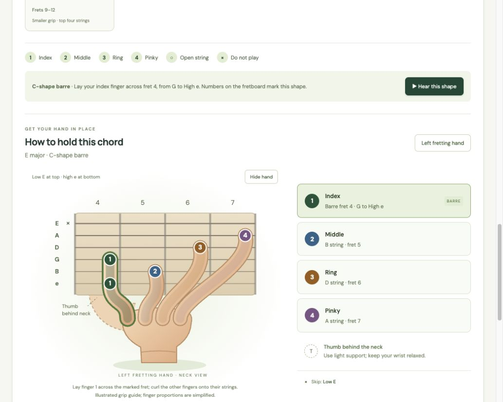

# Fretwise

An Angular guitar practice app for exploring scales, chords, fingerings, and hand positions on a standard-tuned guitar.

[Try the live demo](https://taitran91095.github.io/fretwise/)

## Features

- Major, natural minor, major pentatonic, and minor pentatonic scales.
- Major, minor, major 7 (maj7), minor 7 (m7), dominant 7 (7), sus2, and sus4 chord types with correctly spelled chord tones and formulas.
- Major chords in all five CAGED families (C, A, G, E, D), plus a smaller G-shaped grip. Minor chords offer E, A, and D grips; seventh and suspended chords include practical open and movable grips. Open and movable positions include strummed playback.
- A left hand gripping the neck with fingers at the selected string/fret positions. Toggle Player’s view for high e at the top and the hand above the neck. Hand proportions are simplified; hide the hand to inspect the contact points.
- A 15-fret interactive fretboard, with root notes, finger numbers, and a degree toggle.
- Floating metronome with adjustable tempo, tap tempo, and accented bars; microphone tuner with automatic note detection and standard-string targets. Tuner audio stays on your device and the microphone stops when the tool closes.
- Responsive layouts and keyboard-accessible controls.

C major **scale** is C D E F G A B. C major **chord** is C E G.

Audio uses synthesized browser Web Audio tones. Fonts load from Google Fonts with local fallbacks. No backend or account is required. The tuner needs microphone permission and HTTPS or localhost.

CAGED learning reference: [JustinGuitar chord shapes](https://www.justinguitar.com/modules/chord-shape-explorer).



## Getting started

Use Node.js 22.22.3+, 24.15+, or 26+ (developed with Node 24).

```sh
git clone https://github.com/taitran91095/fretwise.git
cd fretwise
npm ci
npm start
```

Open [localhost:4200](http://localhost:4200).

## Development commands

```sh
npm test              # Run domain, service, component, and integration tests once
npm run test:watch    # Re-run tests as files change
npm run test:coverage # Generate terminal and HTML coverage reports
npm run build         # Build dist/fretwise/browser for production
npm run format        # Format TypeScript, HTML, CSS, and project configuration
npm run format:check  # Check formatting without changing files
```

Tests use Vitest and Angular TestBed with jsdom. Audio tests substitute a controlled Web Audio implementation, so no speaker or browser permissions are required.

## GitHub Pages deployment

The deployment target builds for [taitran91095.github.io/fretwise/](https://taitran91095.github.io/fretwise/) with `baseHref: "/fretwise/"` in `angular.json`. This makes JavaScript, CSS, and favicon URLs resolve under the repository path.

```sh
npm run deploy -- --dry-run # Build and check deployment without publishing
npm run deploy             # Rebuild and publish to the gh-pages branch
```

Deployment requires Git authentication and push access to the repository configured as `origin`. The deployment command publishes to its `gh-pages` branch.

In the repository's GitHub Pages settings, use the `gh-pages` branch and `/ (root)` folder. For a fork, point `origin` to your own repository and update the deployment target's `baseHref` to `/<your-repository-name>/`, including the trailing slash. Local development continues to use `/`.

## Code organization

```text
src/app/
  app.ts / app.html / app.css      Page layout and component wiring
  components/
    sound-selector/               Root, scale family, and scale/chord mode inputs
    note-explorer/                Note cards, pattern, and playback controls
    chord-shape-picker/           Grouped chord shapes and selection controls
    chord-diagram/                Reusable SVG chord diagram
    fretboard/                    Interactive notes and selected finger positions
    hand-position/                Left-hand neck grip and finger instructions
    practice-tools/               Floating menu and tool panels
    metronome/                    Tempo, rhythm, and playback controls
    tuner/                        Pitch display and microphone controls
  domain/
    music.ts                      Note spelling, scale intervals, and chord tones
    chord-shapes.ts                Open shapes, movable barre shapes, descriptions
    instrument.ts                 Standard tuning and fretboard constants
    hand-pose.ts                  Finger contact points, paths, and instructions
    explorer.ts                   Shared interaction types
    pitch-detection.ts            Pitch estimation and tuning offsets
  services/
    explorer-state.ts             Selection state and derived notes/shapes
    audio-playback.ts             Tone synthesis, playback, cancellation, cleanup
    metronome-engine.ts            Audio-clock click scheduling
    tuner-engine.ts                Microphone capture and resource cleanup
```

Components receive typed signal inputs and emit user actions. They do not own shared selection state or access Web Audio directly. `ExplorerState` derives the selected notes, chord shapes, and playback sequences; `AudioPlayback` owns the audio context and cancels stale playback. Music and hand-pose calculations are pure functions, independent of Angular.

Tests live beside the code they cover. Domain tests validate all supported roots and chord families; component tests exercise DOM interactions; service tests cover state transitions and audio cancellation; `app.spec.ts` verifies the components work together.

## License

Licensed under the [MIT License](LICENSE).
